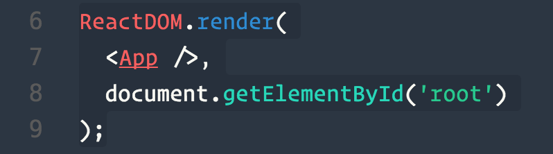

# Activity #1

## Instructions

**Nothing to do here except read. This activity is just to demonstrate a basic Hello World React app.**

JSX is an XML syntax used to describe the HTML React should render inside of our JavaScript.

It's important to recognize that **JSX is not HTML**, it isn't even valid JavaScript. Browsers don't know what to do with it. It is what's known as [sugar-syntax](https://en.wikipedia.org/wiki/Syntactic_sugar).

The JSX used in this file is transpiled by passing it through babel, using webpack to accomplish this. Webpack is a module bundler used to transform JavaScript and other assets in ways described in a webpack configuration file. Babel can be thought of a plugin for webpack which allows the transpilation of ES6 (and newer) code into ES5 code which web browsers made in the last 10 years can understand. The following JSX:

```html
<p>Hello World</p>
```

De-sugars into the following after run through babel:

```js
React.createElement(
    "p",
    null,
    "Hello World"
  );
```

This is the code which is actually run in the web browser. We could write entire applications like this, without using any JSX, but consider code required to describe even slightly more complex HTML code using React:

```html
<div>
  <ul>
    <li>
      <button className="btn btn-default">Click One</button>
    </li>
    <li>
      <button className="btn btn-primary">Click Two</button>
    </li>
    <li>
      <button className="btn btn-danger">Click Three</button>
    </li>
  </ul>
</div>
```

De-sugars into the following JavaScript after being run through Babel:

```js
React.createElement(
  "div",
  null,
  React.createElement(
    "ul",
    null,
    React.createElement(
      "li",
      null,
      React.createElement(
        "button",
        { className: "btn btn-default" },
        "Click One"
      )
    ),
    React.createElement(
      "li",
      null,
      React.createElement(
        "button",
        { className: "btn btn-primary" },
        "Click Two"
      )
    ),
    React.createElement(
      "li",
      null,
      React.createElement(
        "button",
        { className: "btn btn-danger" },
        "Click Three"
      )
    )
  )
);
```

Pretty unrecognizable, right? 

JSX is rendered by the `ReactDOM.render` method:



The first argument is the JSX to be rendered to the DOM. Notice how `<App />` is spelled with capital letters and has a `/` before the closing bracket. Custom React components are spelled with capital letters as to differentiate them from JSX which represents HTML. And all self-closing JSX elements need a closing `/`.

Example, the following:

```html
<input type="text" value={this.state.value} />
``` 

would be expected to represent an HTML `input` element. And this code:

```html
<Input type="text" value={this.state.value} />
``` 

would be expected to represent a custom React component. The difference would be that this component would have it's own file and logic which we may not immediately see just looking at the JSX tag. This Input component may even be comprised of other JSX elements and React components.

Every single JSX element, whether it represents a custom component or basic HTML element, requires either a closing tag, or a self-closing back-slash. See React's JSX documentation for other [JSX gotchas](https://facebook.github.io/react/docs/jsx-in-depth.html).

JSX can be stored in a variable or returned from a function. Examples of "functions" would be [function expressions](https://developer.mozilla.org/en-US/docs/Web/JavaScript/Reference/Operators/function), [function declarations](https://developer.mozilla.org/en-US/docs/Web/JavaScript/Reference/Statements/function#Function_declaration_hoisting), [arrow functions](https://developer.mozilla.org/en-US/docs/Web/JavaScript/Reference/Functions/Arrow_functions), and [methods](https://developer.mozilla.org/en-US/docs/Glossary/Method) (which includes [class](https://developer.mozilla.org/en-US/docs/Web/JavaScript/Reference/Statements/class) methods).

The second argument to the `ReactDOM.render` method is a reference to the real DOM element that will contain the entire React application.

## Helpful Links

* [Babel Repl](http://babeljs.io/repl/): <- allows us to see in the browser how babel will transpile our code.

* [Introduction to JSX](https://facebook.github.io/react/docs/introducing-jsx.html) <- Get used to reading their documentation. Read it cover to cover.

* [JSX in Depth](https://facebook.github.io/react/docs/jsx-in-depth.html)

* [JSX Cheatsheet](https://github.com/DrkSephy/es6-cheatsheet)
