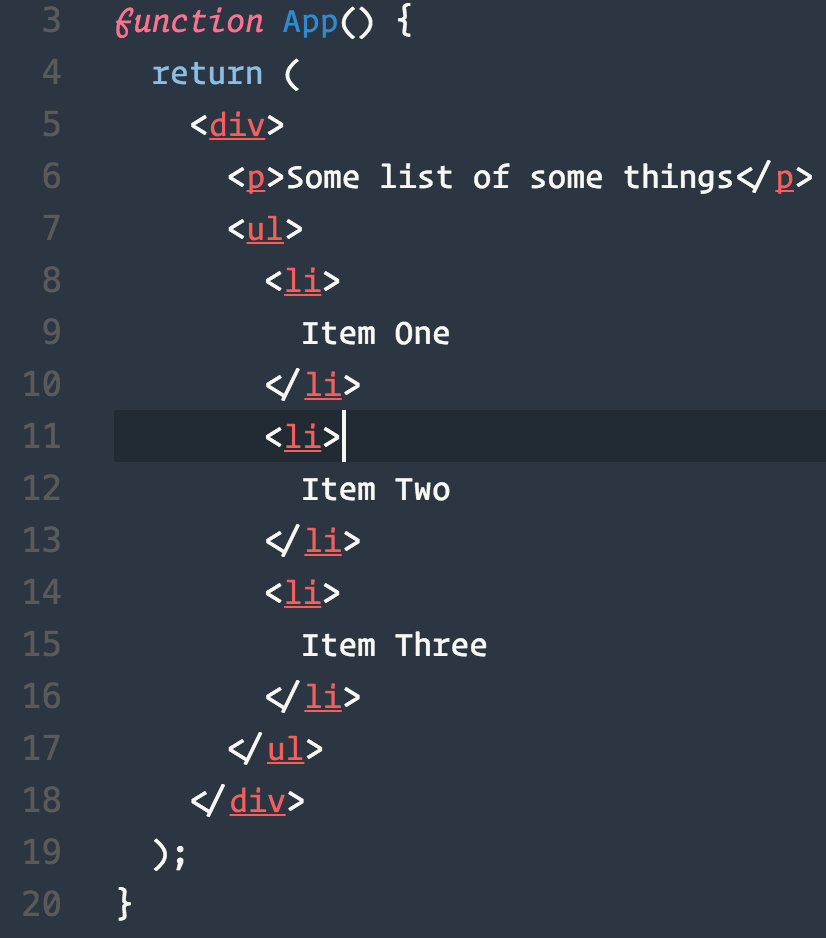

# Activity # 2

This application renders an unordered list:

## Instructions



The key takeaway here is that JSX always needs to have one parent closing tag. i.e. try changing the JSX inside of the App function to this instead:

```js
function App() {
  return (
    <p>Some list of some things</p>
    <ul>
      <li>
        Item One
      </li>
      <li>
        Item Two
      </li>
      <li>
        Item Three
      </li>
    </ul>
  );
}
```

This code would break, since the `<p>` and `ul` tags are both free floating, they need to be contained within one parent element.

This may seem strange, but it's easy to understand:

**You can only return one value from a function,** and having one parent element containing all of the JSX, no matter how much JSX, counts as returning one value.
