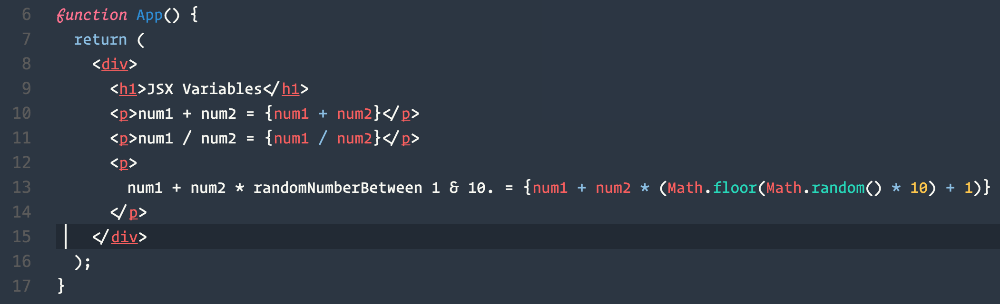

# Activity # 4

## Instructions

In this activity we demonstrate how JavaScript expressions can be evaluated inside of JSX.

The important thing to understand here is that only JavaScript expressions which return a value can be evaluated within the curly braces. Examples include variables, function executions, ternary operators and short circuit evaluations which return a value. Anything you could pass into a function as an argument or assign to a variable will work. If statements and for-loops will not.

Try rendering your name, age, and hobbies inside the JSX!

## Helpful Links

* [If/Else in JSX](http://reactjs.cn/react/tips/if-else-in-JSX.html)
