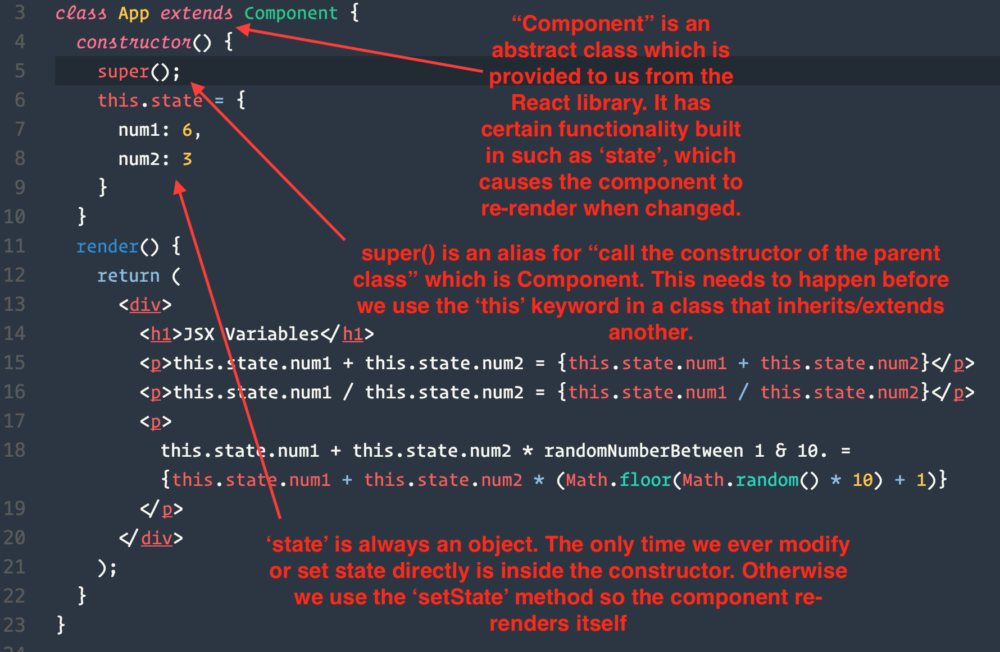

# Activity # 5 Solution



* Constructor is where we set initial values such as state inside of our component. The code here runs only once when a component is first created and before the component is rendered to the DOM.

* `super()` calls the parent class constructor, which is required before setting any properties to `this` inside of a component's constructor or elsewhere. Effectively this instantiates the custom `App` class with all of the properties and behaviors it should inherit from Component.

* Next we set the initial `state` value. State is always an object with key-value pairs. This is the only place we ever set state directly. All subsequent state changes are done with the `setState` method.

  ```js
  class App extends Component {
    constructor() {
      super();
      this.state = {
        hasRendered: false
      };
    }
    render() {
      // modifying state with setState
      this.setState({ hasRendered: true });

      return (
        <p>this.state.hasRendered value is {this.state.hasRendered}
      )
    }
  }

* When state is modified with setState, it tells React to update the Virtual DOM with the change, and then diff the virtual DOM against the real DOM. And then update the real DOM if required.

## Additional Notes

**The constructor is not the best place to perform API calls to fetch initial state data.** Part of why is because the constructor function is synchronous, API calls are asynchronous. So the component may not receive the data since it's already created by the time the API call comes back.

Instead you would make use of [Component LifeCycle Methods](https://facebook.github.io/react/docs/react-component.html#the-component-lifecycle).

LifeCycle methods are [hooks](https://en.wikipedia.org/wiki/Hooking), or functions which execute automatically at certain points throughout the life of a component where you can inject your own custom functionality. 

[componentDidMount](https://facebook.github.io/react/docs/react-component.html#componentdidmount) is the best lifecycle method in which to perform intial AJAX requests.

It's not important to memorize each and every component lifecycle method and the order in which they occur. But it is important to keep them in mind when you want certain actions to take place at the following times:

* When the component is first created

* Before the component mounts

* During the render method

* After the component mounts

* Before the component receives props

* When the component unmounts or is removed from the page
